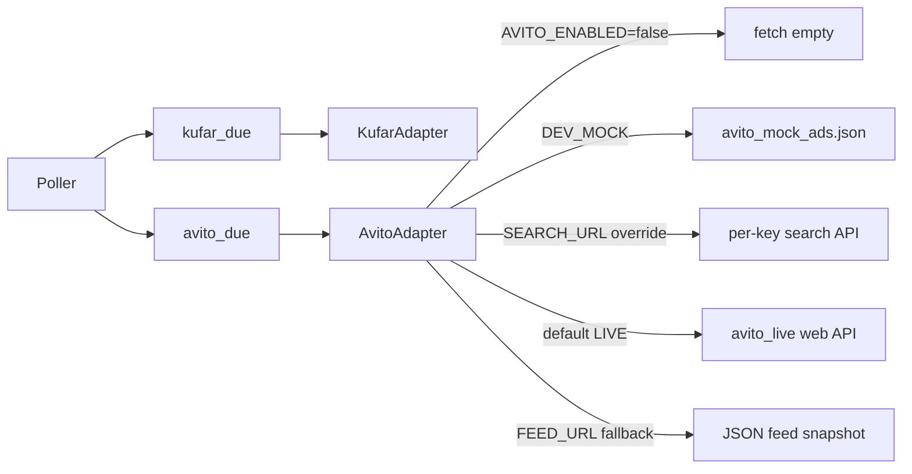

# Архитектура

## Структура проекта

```
main.py              # Запуск: Telegram polling + фоновый poller + RollyPay HTTP
poller.py            # Цикл: Kufar → фильтры → отправка
user_matching.py     # Какие объявления подходят пользователю
kufar_fetch.py       # Запросы к API Kufar
kufar_catalog.py     # Фасеты cat/phm/ppm/ot/rgn/ar по категории
avito_fetch.py       # Mock, search API и JSON feed Avito
avito_live.py        # Built-in live fetch Avito web API
avito_catalog.py     # Query params для collector и live API
kufar_geo.py         # Поиск населённых пунктов (geo/kufar_geo.json)
product_catalog.py   # Категории и списки моделей
filters.py           # Правила отбора объявлений
db.py                # SQLite
config.py            # Настройки из .env
bot_ui.py            # Тексты и клавиатуры меню
formatter.py         # Формат карточки объявления
goods_tree.py        # Линейки внутри категории
payments/            # RollyPay: клиент, fulfillment VIP, webhook HTTP

marketplace/
  types.py           # NormalizedAd, SOURCE_*, COUNTRY_*
  protocol.py        # MarketplaceAdapter Protocol
  kufar.py           # Адаптер Kufar (normalize + fetch_for_key)
  avito.py           # Stub Avito (fetch gated by AVITO_ENABLED)
  registry.py        # get_adapter
  keys.py            # FetchKey (source + категория + geo + модели + память)

avito_geo.py         # Поиск городов России (geo/avito_geo.json)
geo/avito_geo.json   # Seed: Москва, СПб, Смоленск

handlers/
  __init__.py        # Собирает все роутеры
  start.py           # /start, рефералка, ответ на текст
  nav.py             # Меню: цена, память, VIP, пауза, промокод
  goods_ui.py        # Клавиатуры выбора моделей (без роутера)
  goods.py           # Кнопки: товары, bulk, kw, ml, gt, st
  admin.py           # Админ-панель
  helpers.py         # safe_edit_message, is_admin, …
  states.py          # FSM-состояния
```

## Поток рассылки

1. `poller` разделяет due-списки: **Kufar** (`user_is_kufar_pollable`) и **Avito** (`user_is_avito_pollable`, только при `AVITO_ENABLED=true`). Для каждого источника — отдельный `_dispatch_due` с `source=kufar|avito`, без смешивания HTTP-батчей.
2. Группирует пользователей по ключу `source + категория + rgn + ar + модели + память` (память только у смартфонов) и качает маркетплейс **один раз на ключ** через `get_adapter(source).fetch_for_key` (общий TTL `FEED_REFRESH_SECONDS`). Текстовый `query` не используем: на Kufar это полнотекст, а не фильтр модели.
3. Для каждого due — `match_ads_for_user` по батчу его ключа. При catalog: без `smart_filtering` (кроме VIP «идеальные»), магазины (`company_ad`) и тонкий антихлам в заголовке; модель (и память у смартфонов) ещё раз проверяются локально.
4. Новые объявления отправляются в Telegram (`formatter.format_ad`).

Фасеты Kufar: [`kufar_catalog.py`](kufar_catalog.py). Avito — [`marketplace/avito.py`](marketplace/avito.py) + [`avito_live.py`](avito_live.py) (default), [`avito_fetch.py`](avito_fetch.py) (mock/search/feed), [`avito_catalog.py`](avito_catalog.py).

### Фаза 4 — Avito (отдельный трек)



| Компонент | Kufar (BY) | Avito (RU) |
|-----------|------------|------------|
| Geo в БД | `city_rgn`, `city_ar`, `city_label` | `avito_region_id`, `avito_city_id`, `avito_city_label` |
| Geo UI | `kufar_geo` + `city:rgn:` | `avito_geo` + `avito:city:` |
| Poll timestamps | `poll_last_vip`, `poll_last_regular` | `poll_last_avito_vip`, `poll_last_avito_regular` |
| Интервалы | `VIP_CHECK_INTERVAL`, `REGULAR_CHECK_INTERVAL` | `AVITO_VIP_CHECK_INTERVAL`, `AVITO_CHECK_INTERVAL` |
| Feature gate | всегда (BY) | `AVITO_ENABLED` |

Канал данных — [`docs/AVITO_DATA_CHANNEL.md`](docs/AVITO_DATA_CHANNEL.md). По умолчанию built-in live fetch; external URL — optional override.

### Профиль: страна и маркетплейс

| Поле | Значения | Назначение |
|------|----------|------------|
| `users.country` | `by` / `ru` | Страна в UI |
| `users.primary_source` | `kufar` / `avito` | Адаптер для fetch и `source` в seen/prices |

Сейчас активен poll для `by` + `kufar`. Avito: `AVITO_ENABLED=true` + город; данные — built-in live (default), `AVITO_SEARCH_URL` или `AVITO_FEED_URL` (override).

### VIP-потоки (`users.vip_feed_mode`)

| Режим | Где фильтруется |
|-------|-----------------|
| `normal` | Базовые фильтры + модели/память |
| `below_market` | + цена ниже средней |
| `exchange` | + `is_exchange_ad` |
| `ideal` | pre: `ideal_passes(stage=pre)` в `user_matching`; strict: enrich описаний → `ideal_passes(stage=strict)` в `poller`; отклонённые strict помечаются `seen` |

Правила «Идеальные» — `filters.py` (`IDEAL_*`, `parse_battery_percents`); состояние из `condition_label` в `kufar_fetch.normalize_listing`.

### VIP оплата (RollyPay)

При `ROLLYPAY_ENABLED=true` бот поднимает aiohttp на `0.0.0.0:$PORT` (Telegram остаётся на polling):

| Endpoint | Назначение |
|----------|------------|
| `GET /health` | Проверка домена BotHost |
| `POST /webhooks/rollypay` | Callback RollyPay (HMAC `X-Timestamp` + `.` + raw body) |

Тарифы: 7д/$1, 30д/$3, 90д/$7 → сумма в RUB по курсу кассы. Заказы в `vip_payments`; после `paid` — `set_vip`. Резерв: опрос pending каждые `VIP_PAYMENT_POLL_SECONDS`.

Callback URL в панели RollyPay: `{PUBLIC_BASE_URL}/webhooks/rollypay` (или `https://{DOMAIN}/webhooks/rollypay`).

## Поток кнопок

1. Сообщение попадает в один из роутеров (`start` → `nav` → `goods` → `admin`).
2. Чтение/запись настроек — только через `db.py`.
3. Экран «Товары» — логика клавиатур в `goods_ui.py`, обработка нажатий в `goods.py`.

### Ветка «Товары»

| Кнопка | callback | Файл |
|--------|----------|------|
| Товары | `nav:goods` | `nav.py` → категории |
| Категория | `gc:` / `gx:` | `goods.py` |
| Смартфоны | `goods:m` / `goods:a` / `goods:s` | `goods.py` |
| Модель в линейке | `gt:` / `st:` / `lt:` / `pt:` / `wt:` | `goods.py` |

В `goods.py` функции из `goods_ui` импортируются **явно** (не `import *` — иначе имена с `_` не подхватываются).

## Скорость

- При catalog — один fetch на уникальный ключ (категория+город+модели+память), не на пользователя; до `KUFAR_MAX_PAGES` страниц на запрос (cursor).
- VIP опрашивается отдельно (~30 с), обычные — реже (~7 мин); тик poller не длиннее VIP и не ждёт fetch обычных.
- Кэш `market_prices` в памяти на один проход poller; в БД — только цены за `PRICE_DATA_RETENTION_DAYS` (по умолчанию 14), старые строки prune при старте и в poller.
- Минимум лишних запросов к БД в хендлерах (один `get_user` после обновления username).
